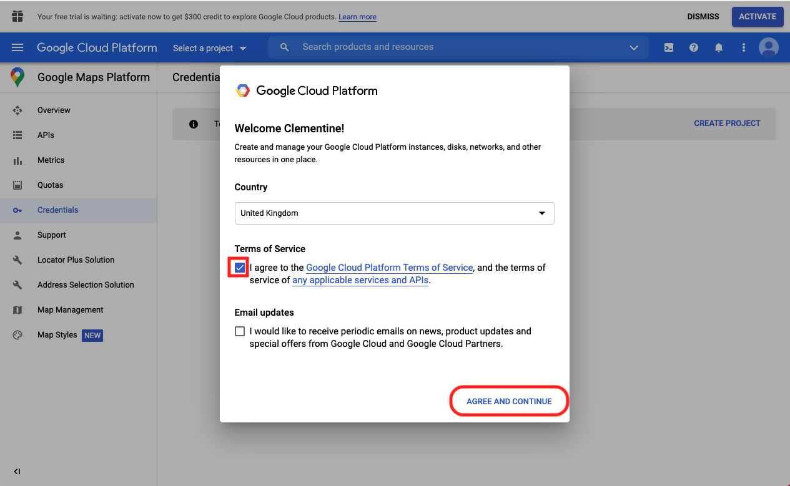
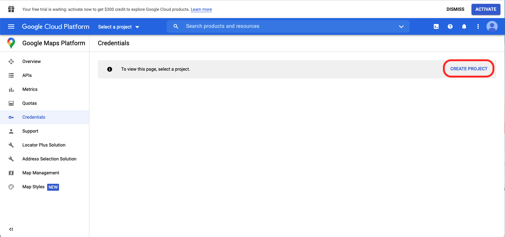
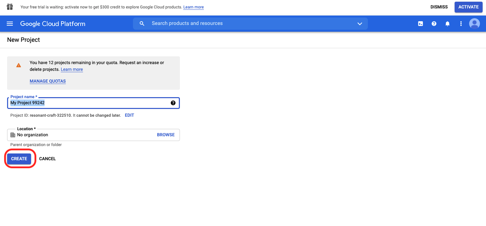
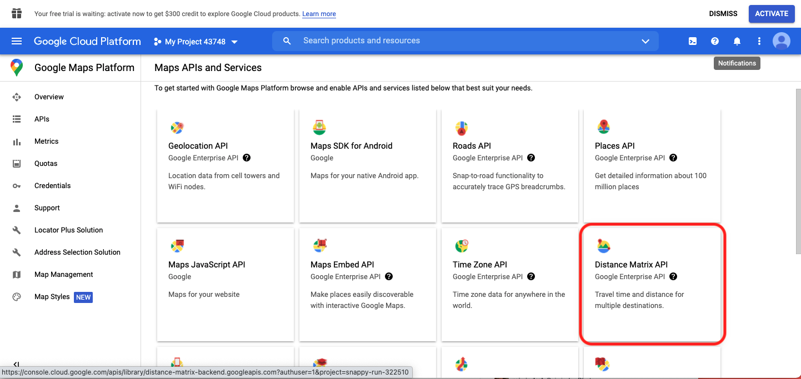
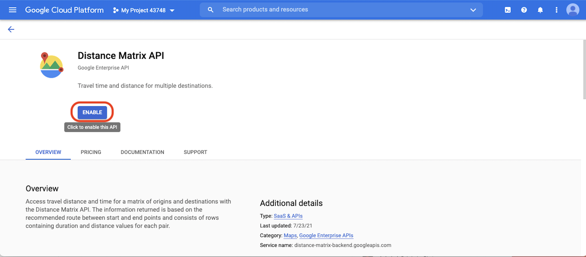
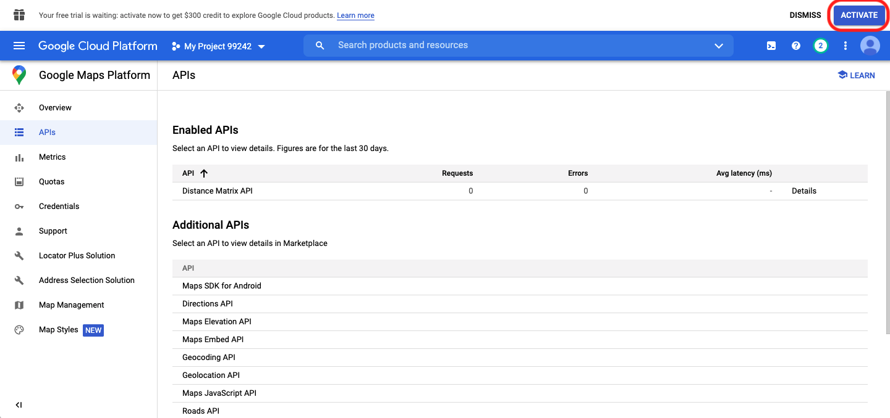
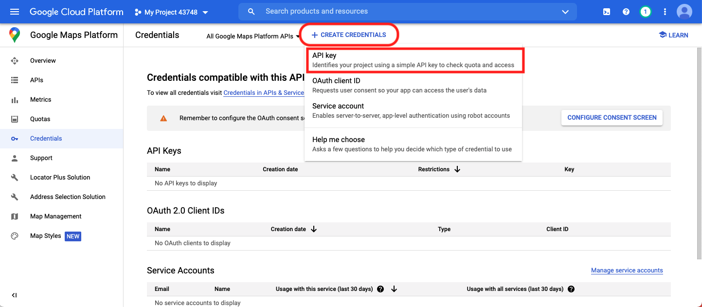

# Google Maps API Key Guide

To get your API key, you need to log in your google account.
Go to the [Google Maps Platform > Credentials page](https://console.cloud.google.com/project/_/google/maps-apis/credentials?_ga=2.234255518.1698015094.1628589628-1781836779.1627411209), and follow the steps here 👇

### 1. Agree term of service and continue

### 2. Click create project

### 3. Create a project
Feel free to name the project name walk2zero and click create

### 4. Choose the API we want to use - Distance Matrix API

### 5. Enable this API - Distance Matrix API

### 6. Activate free trial
Click ACTIVATE on top right banner
This should give you 300 dollars free credit to use GCP service(including distance matrix API) for I believe 90 days

### 7. Create API key
Go back to credential tab on the side bar, and click + CREATE CREDENTIALS,
select API key, then you got your key!

You can always refer back to your API key in the credential tab of Google Cloud Platform!