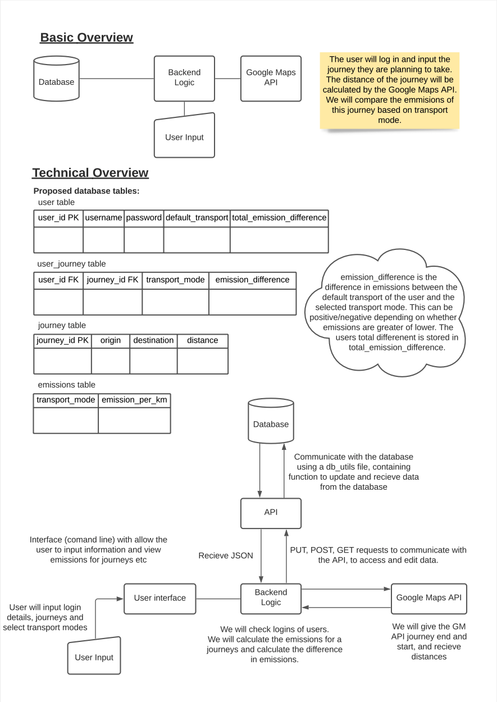

# Walk2Zero

## 👯 The Team‍️
- [Lakshika Juneja](https://github.com/Laksh-13)
- [Rajwinder Bhatoe](https://github.com/rajwinderb)
- [Robyn Seymour-Jones](https://github.com/robynfsj)
- [Shuyan Liu](https://github.com/clemcodes)
- [Sravya Betina](https://github.com/Sravya12379)

## 🏗 What are you building?
We intend to build a tool/service that calculates how much carbon a 
user potentially offset if they opt to walk, cycle or choose 
alternate modes of public transport in lieu of their own personal 
vehicle or Uber to get to their point of destination.
We have named this app to be :
**Walk2Zero** - Taking Climate Conscious Steps for a Cooler Earth

## 🛠 What does it do or what kind of problem does it solve?
Private transport is one of the world’s biggest sources of 
greenhouse gases, with emissions rising every year more so now 
because of the increase in sales of private transport during the 
pandemic & the evident need for social distancing.

In countries like the UK and the US, the transport sector is now 
responsible for emitting more greenhouse gases than any other, 
including electricity production and agriculture. Globally, 
transport accounts for around a quarter of CO2 emissions which adds 
concern for a planet heading to a more than 2 degree celsius global 
temperature crisis violating the conditions of the Paris Climate 
Agreement( an ambitious goal signed by countries to combat climate 
change).

So in this world of unprecedented calamities byproduct of climate 
change and rising temperatures, this idea aids us to act as 
responsible citizens of the earth to contribute in baby steps for a 
bigger change. 

This service/product  aims to help the users cut down the carbon 
footprint of their daily commute by proposing alternative, more 
sustainable methods of transportation. The service will give an 
emission factor associated with each mode of transport and let the 
user make a wise decision on the basis of time, priority and 
accessibility on how they intend to offset their carbon.

## 📍 What are key features of your system?
### Must have
- Allows the user to register to the service
- Allows the user to log in their personal modes of transport ( e.g they might have a razor scooter or a cycle or a car)
- Identifies user location
- Identifies final destination
- Returns the distance of travel
- Proposes all modes of transport viable based on the distance, age factor and taking into consideration personal modes of transport . (<5km: could walk, >5km: cycle or take a bus)
- Calculates emissions based on the proposed modes of transport and potential distance travelled
- Returns a carbon offset figure based on the user choice
- Congratulates the user on offsetting the amount of carbon by comparing their work to  trees :) (for e.g. your carbon offset amounted to 20 trees worth of work, good job!)
### Good to have
- Can calculate calories burned by walking
- Allows the user to create and participate in challenges with friends (such as fitbit challenges)
- A fancier front end with HTML and CSS tools.

## 🧭 Architecture diagram

## 📝 Flow chart

## 👷 Team's approach to the project work
### Workload Distribution
Before we distribute workload, we will break down user stories to manageable tasks/tickets on Github kanban board, 
and estimate story points to each ticket, prioritising our backlog according to its importance as well as its size(story points). 

We will then distribute workload based on the team member's interest and make sure each of us has
similar size of tickets. If a ticket size is large, we will assign two people on the ticket, or more if necessary.
We will also make sure the rest teammates review the code before the pull request being merged.

Because things are new to the team, and we are still learning, the roles will be interchangeable this time.

### Code Management

### Testing Plan
1. Functional testing: Run functional tests for each function throughout the application.
        We are aiming to test every single function by passing appropriate input and validating the output.
        Each and every person has taken responsibility to check all the functions belonging to their individual tasks/stories.
2.  Pair testing: Collaborating and testing functionality.
        After integrating individual stories together, we have decided to adopt pair testing.
       We are clinched to integrate a couple of stories and test their functionality. We have concluded to divide these pieces of combined tasks between two of us, take scenarios, collaborate and test the functionality.
3.  Blackbox testing: Conducting tests by person without any prior knowledge.
      After testing and finalising the whole integrated application, we are aiming to employ black-box testing through any person from another team who doesn't have any idea of internal code
4.  Unit-testing: Testing individual components.
       One person from our team is going to validate every component by designing test cases for diverse inputs and confirming the functioning of units.
