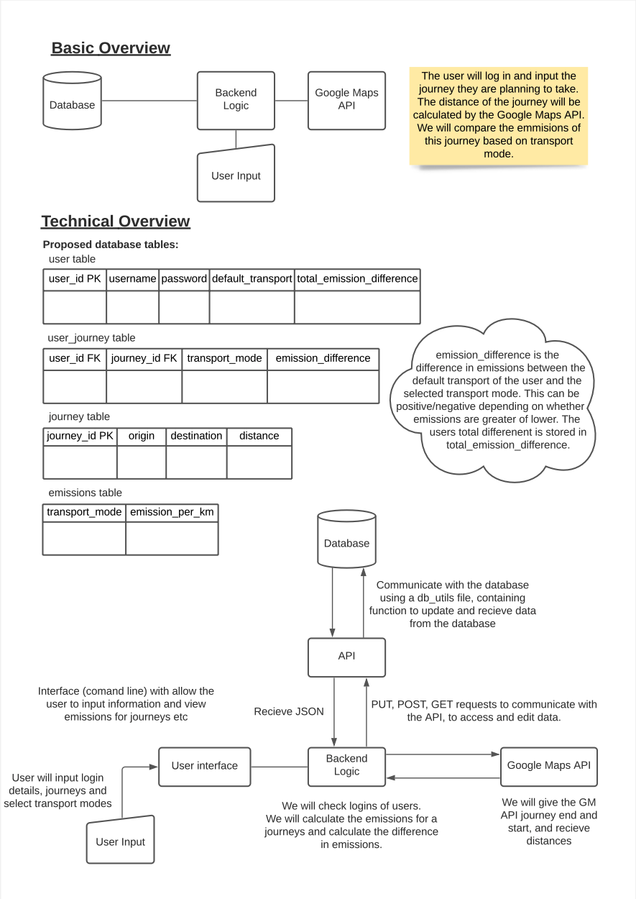
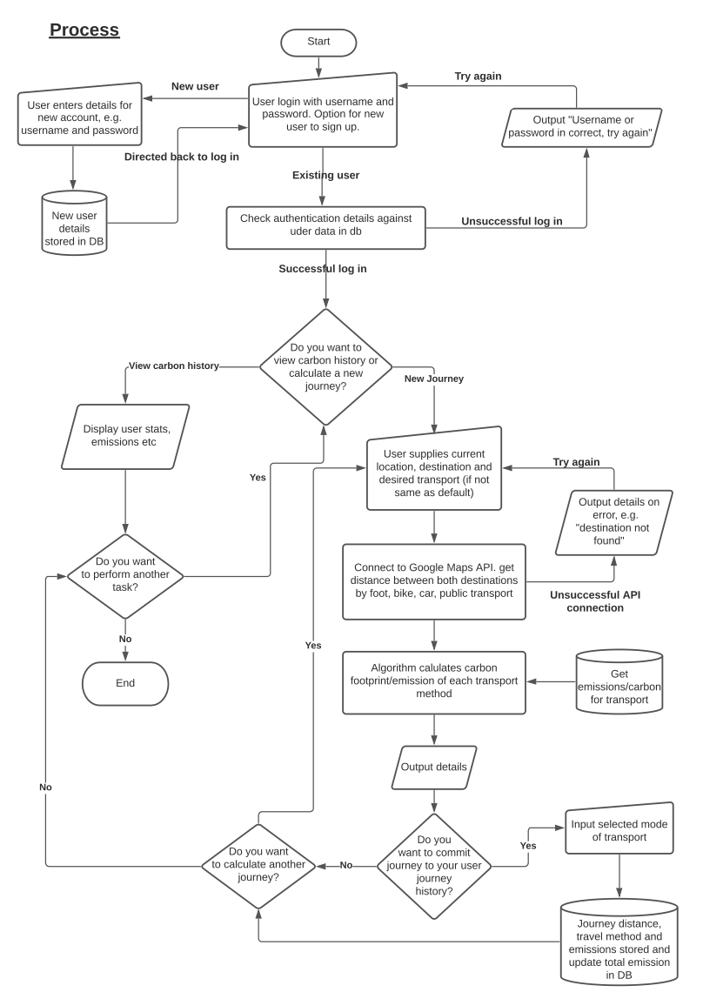

# Software Week 2 Homework – Walk2Zero Project Description

## 👯 The Team‍️
- [Lakshika Juneja](https://github.com/Laksh-13)
- [Rajwinder Bhatoe](https://github.com/rajwinderb)
- [Robyn Seymour-Jones](https://github.com/robynfsj)
- [Shuyan Liu](https://github.com/clemcodes)
- [Sravya Betina](https://github.com/Sravya12379)

## 🏗 What are you building?
We intend to build a tool/service that calculates how much carbon a user could 
potentially offset if they opt to walk, cycle or take public transport instead
of their own personal vehicle or Uber to get to their destination.  

We have named this app to be:  
**Walk2Zero** – Taking Climate Conscious Steps for a Cooler Earth  

## 🛠 What does it do or what kind of problem does it solve?
Private transport is one of the world’s biggest sources of greenhouse gases. 
Although mobility reduced during the pandemic, there was an increase in the use 
of private transport due to the evident need for social distancing. Previous 
crises have spurned long-term shifts in transport preferences (IEA, 2021). 
It is important that the reliance on the use of private vehicles is not 
maintained after this one.  

In countries like the UK and the US, the transport sector is now responsible 
for emitting more greenhouse gases than any other, including electricity 
production and agriculture. For example, in the UK, transport emitted 122 
MtCO2e in 2019, the largest amount of any industry and accounting 
for 27% of all UK greenhouse gas emissions that year (Department for Transport, 
2021). Globally, transport accounts for around a quarter of CO2 
emissions and there are concerns that this is hindering progress towards the 
Paris Climate Agreement, which saw countries set an ambitious goal to limit the 
global temperature rise this century to "well below 2, preferably to 1.5 
degrees Celsius, compared to pre-industrial levels" (UNFCC, 2021).  

In this world of unprecedented calamities that are occurring as byproducts of 
climate change and rising temperatures, our project idea helps us to act as 
responsible citizens of the earth and to contribute a small step towards a 
bigger change.  

Our service aims to help the users reduce the carbon footprint of their daily 
commute or trip out by proposing alternative, more sustainable methods of 
transportation. The service will give an emission factor associated with each 
mode of transport and let the user make a wise decision on how they intend to 
travel, and hopefully offset some of their carbon footprint, on the basis of 
time, priority and accessibility. It is hoped that visibly seeing the impact of 
their journey with a number (amount of carbon offset) or something more easy to 
relate to (e.g. equivalent number of trees planted) would spurn more people 
into making a better transport decision. Allowing users to track their total 
carbon offset of all journeys made can help them to keep track of the 
difference they are making. A finished product could even offer a social aspect 
so user could compete with friends to save offset the most carbon.

## 📍 What are key features of your system?
### Must have
- Allows the user to register to the service
- Allows the user to store their personal modes of transport (e.g they might 
have an electric scooter, a bike or a car)
- Identifies user location
- Identifies final destination
- Returns the distance of travel
- Proposes all modes of viable transport based on the distance, the user's 
mobility (e.g. age, physical abilities) and their stored personal modes of 
transport (e.g. <5km could walk, >5km cycle or take a bus)
- Calculates emissions based on the proposed modes of transport and potential 
distance travelled
- Returns a carbon offset figure based on the user's chosen mode of transport
- Congratulates the user for the amount of carbon they have offset by comparing 
their work to number of trees planted, e.g. your carbon offset amounted to 20 
trees being planted, good job!)  

### Good to have
- Can calculate calories burned by walking
- Allows the user to create and participate in challenges with friends (such as 
Fitbit challenges)
- A fancier front end with HTML and CSS

## 🧭 Architecture diagram

## 📝 Flow chart

## 👷 Team's approach to the project work
### Workload Distribution
Before we distribute the workload, we will break down user stories into 
manageable tasks/tickets on a Github Kanban board and estimate the story points 
(amount of work required) for each ticket, prioritising our backlog according 
to its importance as well as its size (story points).  

We will then distribute the workload based on the team member's interest and 
make sure each of us has a similar size of tickets. If a ticket size is large, 
we will assign two people to the ticket (or more if necessary). We will also 
make sure the rest of our team reviews the code before the pull request is
merged.

We are aware that in a normal development team, each member would take on a 
specific role (e.g. Scrum Master, Product Owner, Development Team member). 
However, as many things are new to the team and we are still learning, the 
roles will be interchangeable this time.

### Code Management
#### Version Control
We are managing our code using Git version control and remotely hosting the 
project repository on GitHub. Several developer branches will be created. Each 
developer branch will be created to work on a specific task and will be checked 
out by one person at a time. As mentioned earlier, we are using the Kanban 
boards within GitHub to manage the tasks and track who is working on what and 
who has checked out each branch. Branches will be merged into main after they 
have been tested.

#### Directories and Files
We will have an organised and structured directory tree. The code will be split 
across several files and will include a main script, unit test scripts, 
a db utils file, a db config file, a flask app file, a script containing the 
algorithms that calculate carbon emissions for different modes of transport 
and any others that will be required.

#### The Code Itself
We will implement suitable class, method and variable names that are not too 
long but are descriptive enough to understand what they are. For example, a 
suitable method name would be `calc_carb` rather than `calculate_carbon` (which 
is a bit long) or `cc` (which is not descriptive enough). 

The code will be written using the Object Orientated Programming (OOP) style 
and will make use of reusable blocks of code. This will make development as a 
team easier, as each person can be working on a small block.

### Testing Plan
1. **Functional testing**: Run functional tests for each function throughout 
the application. We are aiming to test every single function by passing 
appropriate input and validating the output. Each and every person has taken 
responsibility to check all the functions belonging to their individual 
tasks/stories.  

2. **Pair testing**: Collaborating and testing functionality. After integrating 
individual stories together, we have decided to adopt pair testing. We are 
clinched to integrate a couple of stories and test their functionality. We have 
concluded to divide these pieces of combined tasks between two of us, take 
scenarios, collaborate and test the functionality.  

3. **Blackbox testing**: Conducting tests by a person without any prior 
knowledge. After testing and finalising the whole integrated application, we 
are aiming to employ black-box testing by asking someone from another team, who 
doesn't have any idea of internal code, to try out our program.  

4. **Unit testing**: Testing individual components. One person from our team is 
going to validate every component by designing test cases for diverse inputs 
(end cases) and confirming the functioning of units.  

## 📚 References
Department for Transport (2021) *Transport and Environment Statistics
2021 Annual report*. 
Available online: https://assets.publishing.service.gov.uk/government/uploads/system/uploads/attachment_data/file/984685/transport-and-environment-statistics-2021.pdf 
[Accessed: 2021-08-01]

IEA (2021) *Changes in transport behaviour during the Covid-19 crisis*. 
Available online: https://www.iea.org/articles/changes-in-transport-behaviour-during-the-covid-19-crisis 
[Accessed: 2021-08-01]  

UNFCC (2021) *The Paris Agreement*. 
Available online: https://unfccc.int/process-and-meetings/the-paris-agreement/the-paris-agreement 
[Accessed: 2021-08-01]
